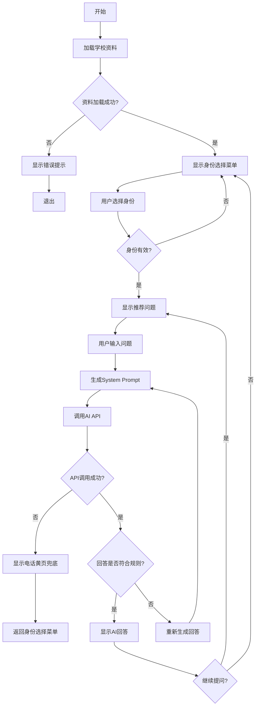
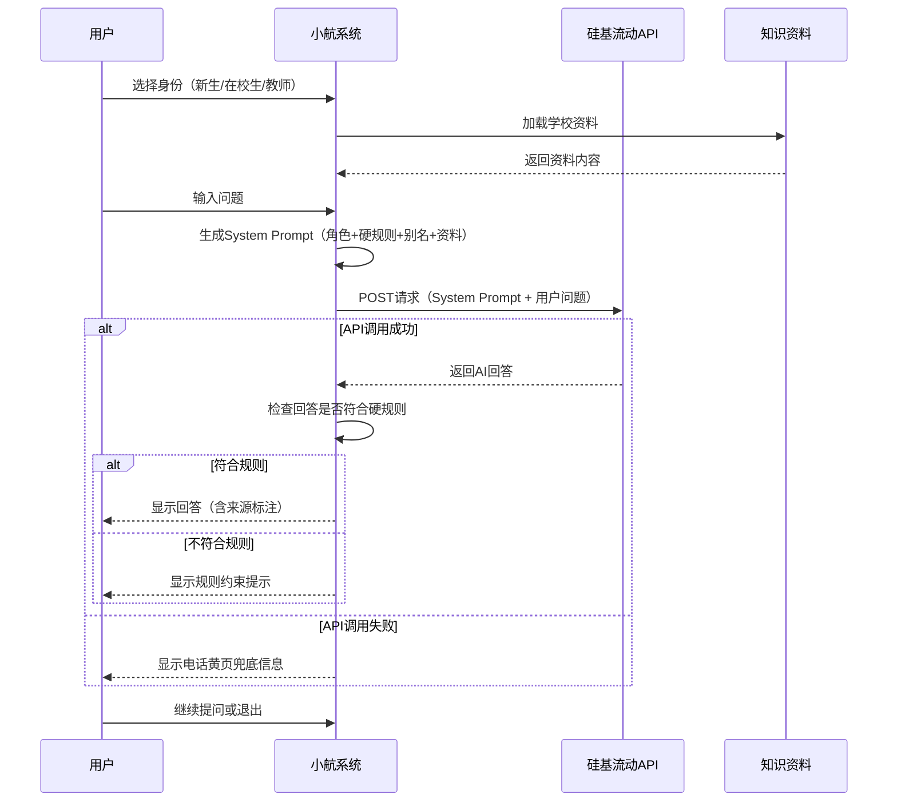

# "小航"校园智能问答系统 - 功能模块设计与流程图

## 一、功能模块清单

### 模块1：身份选择模块

| 属性 | 描述 |
|------|------|
| 模块名称 | 身份选择模块 |
| 功能说明 | 用户进入系统后选择身份，支持新生、在校生、教师三种身份 |
| 输入 | 用户选择的身份编号 |
| 输出 | 身份标识（新生/在校生/教师） |
| 依赖 | 无 |
| 异常处理 | 无效输入提示重新选择 |

### 模块2：知识加载模块

| 属性 | 描述 |
|------|------|
| 模块名称 | 知识加载模块 |
| 功能说明 | 从data文件夹加载4个Markdown资料文件，拼接成完整知识文本 |
| 输入 | 数据目录路径 |
| 输出 | 拼接后的学校资料文本 |
| 依赖 | data文件夹中的md文件 |
| 异常处理 | 文件不存在时打印警告，继续加载其他文件 |

### 模块3：Prompt生成模块

| 属性 | 描述 |
|------|------|
| 模块名称 | Prompt生成模块 |
| 功能说明 | 根据用户身份生成包含角色定义、硬规则、别名词典和知识资料的完整System Prompt |
| 输入 | 身份标识、学校资料文本 |
| 输出 | 完整的System Prompt字符串 |
| 依赖 | 身份角色模板、防幻觉硬规则、别名词典 |
| 异常处理 | 未知身份使用默认模板 |

### 模块4：AI问答模块

| 属性 | 描述 |
|------|------|
| 模块名称 | AI问答模块 |
| 功能说明 | 调用硅基流动API，发送System Prompt和用户问题，获取AI回答 |
| 输入 | System Prompt、用户问题 |
| 输出 | AI生成的回答文本 |
| 依赖 | 硅基流动API、网络环境 |
| 异常处理 | 网络错误、API返回错误、响应格式错误均有处理 |

### 模块5：推荐问题模块

| 属性 | 描述 |
|------|------|
| 模块名称 | 推荐问题模块 |
| 功能说明 | 根据身份显示对应的推荐问题列表，用户可点击编号快速提问 |
| 输入 | 身份标识 |
| 输出 | 推荐问题列表（编号+问题） |
| 依赖 | 推荐问题配置字典 |
| 异常处理 | 无 |

### 模块6：电话黄页模块

| 属性 | 描述 |
|------|------|
| 模块名称 | 电话黄页模块 |
| 功能说明 | 显示校园各部门联系方式，作为API故障时的兜底方案 |
| 输入 | 无（或部门名称查询） |
| 输出 | 部门联系方式列表 |
| 依赖 | phone_book.py中的数据 |
| 异常处理 | 查询不存在的部门返回None |

### 模块7：静态页面模块

| 属性 | 描述 |
|------|------|
| 模块名称 | 静态页面模块 |
| 功能说明 | 当系统发生严重异常时，显示不依赖API的静态信息页面 |
| 输入 | 无 |
| 输出 | 静态服务信息（报到指引、办事指南、紧急联系方式） |
| 依赖 | 无（完全独立） |
| 异常处理 | 作为最终兜底，不依赖其他模块 |

---

## 二、系统流程图

---

## 三、问答流程详细图

---

## 四、边界声明

### 4.1 能聊的内容

| 类别 | 具体内容 |
|------|---------|
| 新生入学 | 报到流程、缴费方式、宿舍分配、校园卡办理、军训安排、入学须知 |
| 在校生事务 | 证明办理、证件补办、请假流程、成绩单打印、宿舍报修、奖学金申请 |
| 教师事务 | 差旅报销、课表查询、教材领取、会议室预约、科研经费、职称评审 |
| 通用服务 | 图书馆服务、食堂信息、校园网、校医院、保卫处、就业指导 |
| 应急服务 | 紧急联系方式、心理援助、防骗提醒 |

### 4.2 不能聊的内容

| 类别 | 具体内容 | 原因 |
|------|---------|------|
| 个人信息查询 | 成绩、课表、一卡通余额、个人档案 | 无法接入学校系统，涉及隐私 |
| 系统操作 | 选课、缴费、请假审批、成绩申诉 | 需要在学校官方系统操作 |
| 主观评价 | 食堂饭菜好不好吃、老师教学水平 | 主观问题，无客观答案 |
| 闲聊娱乐 | 天气、新闻、笑话、情感问题 | 超出校园服务范围 |
| 非法违规 | 作弊、代考、违法活动咨询 | 违反校规校纪 |
| 编造信息 | 资料中没有的电话、地址、时间 | 防幻觉硬规则要求 |

### 4.3 数据更新日期

| 数据文件 | 最后更新日期 | 更新频率 |
|---------|-------------|---------|
| 01_新生入学.md | 2026年7月14日 | 每学期开学前 |
| 02_办事流程.md | 2026年7月14日 | 政策变更时 |
| 03_电话黄页.md | 2026年7月14日 | 联系方式变更时 |
| 04_应急防骗.md | 2026年7月14日 | 突发事件后 |

### 4.4 服务边界

- **服务时间**：7×24小时
- **服务范围**：仅限郑州航空工业管理学院校园相关事务
- **回答来源**：仅基于提供的4个Markdown资料文件
- **免责声明**：系统回答仅供参考，最终以学校官方通知为准

---

**文档版本**：V1.0  
**编写日期**：2026年7月14日  
**适用项目**："小航"校园智能问答系统
